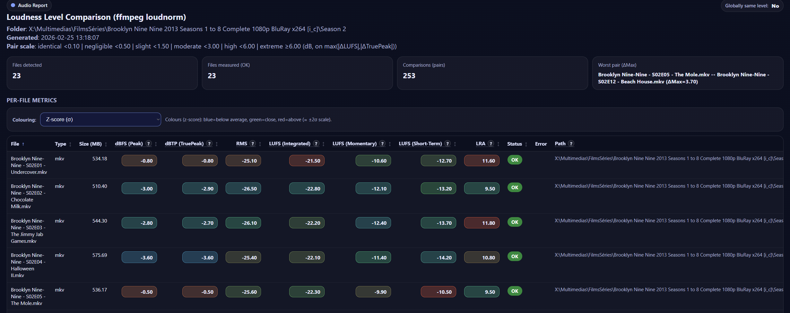

# LoudScan

**Batch audio loudness analyser — compare LUFS, True Peak, LRA, RMS and Peak across your entire media library in one interactive HTML report.**

Drop a folder full of MP3s, WAVs, MP4s or any other common format and LoudScan will analyse every file with FFmpeg, then produce a self-contained HTML report and a CSV export so you can instantly spot which files are too loud, too quiet, or inconsistent.

## Example of the begining of report html : 


---

## Download

> **No Python? No problem.**
> Pre-built executables are available on the [Releases page](https://github.com/Blaztekk/LoudnessVarReport/releases/latest) — just download, install FFmpeg, and run.

| Platform | File |
|---|---|
| Windows | `LoudScan-windows.exe` |
| macOS | `LoudScan-macos` |

**FFmpeg is required on all platforms** (the app calls it at runtime — it is not bundled).

```bash
# Windows (winget)
winget install ffmpeg

# macOS (Homebrew)
brew install ffmpeg
```

Then just double-click the executable or run it from a terminal.

---

## Why LoudScan?

When you're delivering audio for broadcast, streaming, podcast, or video production, consistent loudness matters. LoudScan lets you:

- **Audit a batch of files** without opening a DAW
- **Spot clipping instantly** — True Peak and Peak (dBFS) cells turn red if ≥ 0 dB
- **Compare every file pair** — all pairwise ΔMax values are ranked and colour-coded
- **Check broadcast compliance** — select a delivery standard (EBU R128, Spotify, Netflix…) and see at a glance which files are in range
- **See the big picture** — the "Globally same level?" indicator tells you at a glance whether your pool is balanced

---

## Features

- EBU R128 / ITU-R BS.1770 integrated loudness (LUFS), True Peak (dBTP) and Loudness Range (LRA)
- Raw Peak (dBFS) and RMS (dBFS) via FFmpeg `volumedetect` — single-pass, fast
- Interactive HTML report: dark theme, sortable columns, tooltip explanations
- **Three colouring modes in one dropdown:**
  - *Relative* — Δ vs median, Δ vs mean, or Z-score (compare files to each other)
  - *Broadcast standards* — absolute Blue/Green/Red per platform target (EBU R128, Spotify, Apple Music, Netflix, YouTube, CD, Podcast…)
  - *None* — disable colouring
- Clipping warnings (red highlight) for True Peak and Peak ≥ 0 dB — overrides any colouring mode
- Configurable reference presets via `reference_models.json` (see below)
- Pairwise similarity table with 6 heuristic levels: **identical → negligible → slight → moderate → high → extreme**
- CSV export for further analysis in Excel, Python, etc.
- Recursive folder scan — works on nested folder structures
- GUI folder picker (tkinter) with CLI fallback

Note: on **macOS**, some Python installations ship without Tk support, so the folder picker may be unavailable and LoudScan will fall back to the terminal prompt.
If tkinter is unavailable, LoudScan also tries an OS-native dialog (PowerShell on Windows, AppleScript on macOS, zenity on Linux) before falling back to the terminal.

---

## Supported formats

`.mp3` `.mp4` `.m4a` `.wav` `.flac` `.ogg` `.mkv` `.mov` `.m4v`

---

## Reference models (`reference_models.json`)

LoudScan ships with a set of broadcast and streaming **reference presets** that define acceptable loudness ranges per metric. These presets power the colouring dropdown in the HTML report.

### Built-in presets

| Preset | LUFS target | TP ceiling | Notes |
|---|---|---|---|
| EBU R128 (TV Europe) | −23 LUFS ±1 | −1 dBTP | EBU R128 |
| ATSC A/85 (TV US/Canada) | −24 LUFS ±1 | −2 dBTP | ATSC A/85 |
| Spotify | −14 LUFS | −1 dBTP | Normalises to −14 |
| Apple Music / iTunes | −16 LUFS | −1 dBTP | Sound Check |
| YouTube | −14 LUFS | −1 dBTP | — |
| Tidal / Amazon Music | −14 LUFS | −1 dBTP | — |
| Netflix (OTT) | −27 LUFS ±2 | −2 dBTP | OC-3-1 spec |
| CD Mastering | — | −0.1 dBFS / −0.3 dBTP | Peak ceiling |
| Apple Podcasts | −16 LUFS ±1 | −1 dBTP | — |
| Custom | user-defined | user-defined | Edit the JSON |

Colour legend for broadcast modes: **Blue** = below minimum · **Green** = within range · **Red** = above maximum

### Customising presets

The presets are read from `reference_models.json` at report-generation time. You can add, remove, or edit presets freely — LoudScan will pick them up without rebuilding.

**When running from source** — edit `res/reference_models.json` in the project root.

**When running the build executable** — place a `reference_models.json` file **in the same folder as the executable**. If present, it takes priority over the version bundled at build time.

#### JSON schema

```jsonc
{
  "version": 1,
  "presets": [
    {
      "id": "my_preset",          // unique snake_case identifier
      "label": "My Platform",     // displayed in the dropdown
      "description": "...",       // shown in the legend when selected
      "metrics": {
        "LUFS_I":        { "min": -18.0, "max": -14.0, "target": -16.0 },
        "TruePeak_dBTP": { "min": null,  "max": -1.0 },
        "Peak_dBFS":     { "min": null,  "max": -0.1 },
        "RMS_dBFS":      { "min": null,  "max": null  },
        "LRA":           { "min": null,  "max": 20.0  }
      }
    }
  ]
}
```

- Set `"min"` or `"max"` to `null` to disable that bound.
- Omit a metric entirely to show no colour for it in that preset.
- `"target"` is optional and only used in tooltip text.

---

## Run from source

**Requirements:** Python 3.8+ · [FFmpeg](https://ffmpeg.org/download.html) in `PATH` · No pip packages needed

```bash
git clone https://github.com/YOUR_USERNAME/loudscan.git
cd loudscan
python sound_report.py
```

### Build executables (optional)

Builds are intended to be done locally and uploaded to GitHub Releases.

```bash
python -m pip install -r requirements-build.txt
pyinstaller --clean --noconfirm loudscan.spec
```

`reference_models.json` is automatically bundled inside the executable at build time. Users can still override it by placing an external copy next to the `.exe` / binary.

1. A folder picker dialog opens (or type the path if no GUI is available)
2. LoudScan scans the folder recursively and analyses every supported file
3. Two files are generated inside the selected folder:
   - `sound_report_DD-MM-YY_HH-MM.html` — open in any browser
   - `sound_report_DD-MM-YY_HH-MM.csv` — import into Excel / pandas

### Example output

```
Folder: /path/to/my/audio
Analysing loudness of 12 file(s)...
[1/12] track_01.wav
[2/12] track_02.wav
...
Done. Reports generated:
 - HTML: /path/to/my/audio/sound_report_24-02-26_14-30.html
 - CSV : /path/to/my/audio/sound_report_24-02-26_14-30.csv
```

---

## HTML report overview

| Section | What it shows |
|---|---|
| **KPI bar** | Total files, measured OK, pair count, worst pair |
| **Per-file metrics table** | dBFS, dBTP, RMS, LUFS, LRA — colour-coded, sortable, with file path |
| **Colouring selector** | *Aucun* (off) · *Relative* (Δ vs median / mean / Z-score) · *Broadcast standard* |
| **Pairwise table** | Every file pair, sorted by ΔMax, with similarity badge |
| **Distribution histogram** | Count of pairs per similarity level |

### Column order

| # | Column | Description |
|---|---|---|
| 1 | File | Filename |
| 2 | Type | Extension |
| 3 | Size (MB) | File size |
| 4 | dBFS (Peak) | Raw integer peak — red if ≥ 0 dB |
| 5 | dBTP (TruePeak) | Inter-sample true peak — red if ≥ 0 dB |
| 6 | RMS | Average RMS energy level |
| 7 | LUFS | Integrated loudness (EBU R128) |
| 8 | LRA | Loudness range (dynamics) |
| 9 | Status | OK / Error |
| 10 | Error | Error message if analysis failed |
| 11 | Path | Full path to source file |

### Similarity scale

Based on `ΔMax = max(|ΔLUFS|, |ΔTruePeak|)`:

| Level | ΔMax |
|---|---|
| identical | < 0.10 dB |
| negligible | < 0.50 dB |
| slight | < 1.50 dB |
| moderate | < 3.00 dB |
| high | < 6.00 dB |
| extreme | ≥ 6.00 dB |

---

## License

MIT — free to use, modify and distribute.

---

## Contributing

Issues and pull requests are welcome. If you encounter a file format that fails to analyse, please open an issue and include the FFmpeg version and file codec info (`ffprobe -v quiet -show_streams your_file`).

---

*Open source · Built with the assistance and virtual hands of AI*
